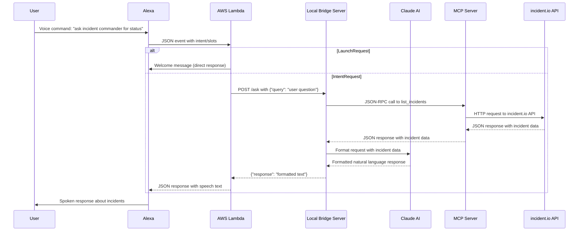

# alexa-incident-commander
Incident Managment Alexa powered voice assistant backed up by incident.io 

A powerful Alexa skill that provides real-time incident status updates through natural voice commands. Built for the incident.io competition.

# Overview

Sometimes I just want a voice assistant to tell me about what's going on instead of looking at my computer screen and a thousand pages and dashboards , what if I want to know about incidents as if I am talking to colleague , with this Alexa skill backed by incident.io MCP server , it can now be a reality !

## 🎥 Demo Video
[

## ✨ Features

- **Voice-Activated Incident Updates**: Get real-time incident status through Alexa
- **Natural Language Processing**: Claude AI-powered response generation
- **Real-time Data**: Live integration with incident.io MCP server
- **Hands-Free Operation**: Perfect for incident war rooms and on-call engineers

## 🛠️ Technical Implementation

1. **Alexa Skill**: Voice interface with natural language understanding
2. **AWS Lambda**: Cloud-based request orchestration
3. **Local Bridge Server**: Flask app connecting Lambda to local services
4. **Claude AI**: Natural language response generation
5. **incident.io MCP Server**: Real-time incident data access

### Architecture

# Limitations

- This is a POC , the local bridge server should ideally be another AWS lambda function
- The code can be improved for portability , it does not allow setting of custom ports , bridge url for the local bridge server at the moment
- More rigorous Alexa testing is required

# Setup

Read more about how to set this up yourself [here](instructions/setup.md)

