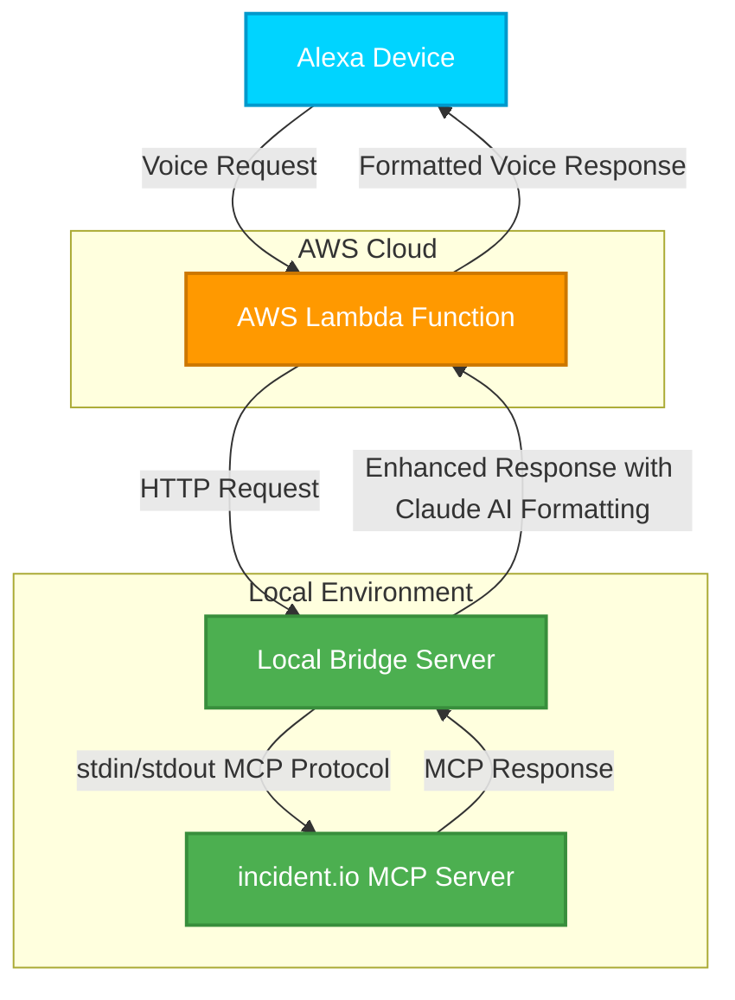

# alexa-incident-commander
Incident Managment Alexa powered voice assistant backed up by incident.io 

A powerful Alexa skill that provides real-time incident status updates through natural voice commands. Built for the incident.io competition.

# Overview

Tired of looking at screens ?  Now you can just ask Alexa what's broken - she'll gossip about your incidents like a well-informed colleague who actually reads the postmortems! 🗣️☕️

Incident Commander is an Alexa skill that provides voice-controlled access to your incident.io data through a local MCP server bridge, enabling natural language queries about incidents and outages.

## 🎥 Demo Videos
- [Watch Alexa light up !](https://drive.google.com/file/d/1TAFKjdpsVNcOQ-EUT9xgVwtFUhv9o7sQ/view?usp=sharing)
- [Watch sleep-deprived me talking](https://drive.google.com/file/d/1TAFKjdpsVNcOQ-EUT9xgVwtFUhv9o7sQ/view?usp=sharing)

## ✨ Features

- **Voice-Activated Incident Updates**: Get real-time incident status through Alexa
- **Natural Language Processing**: Claude AI-powered response generation
- **Real-time Data**: Live integration with incident.io MCP server
- **Hands-Free Operation**: Perfect for incident war rooms and on-call engineers

## 🛠️ Technical Implementation

1. **Alexa Skill**: Voice interface with natural language understanding
2. **AWS Lambda**: Cloud-based request orchestration
3. **Local Bridge Server**: Flask app connecting Lambda to local services
4. **Claude AI**: Natural language response generation
5. **incident.io MCP Server**: Real-time incident data access

### Architecture

# Limitations

- This is a POC , the local bridge server should ideally be another AWS lambda function
- We are currently only using one of the tools from the incident.io mcp server , we can extend it further to give more personalized information

# Setup
Read more about how to set this up yourself [here](setup.md)

# Want to play around ?

Email me at toshreyashah@gmail.com and i will add you as a beta tester in the Alexa skill,
you will be able to access the alexa dashboard via this [link](https://skills-store.amazon.com/deeplink/tvt/fa36c56c05814857c549e49e0f2d8a5709a064a4b7ef65205055a01c9975a3d9d2f174bff6dd88124dfece073fa02965a0a4ff5d512d6185188cc13377bf81869cac2c0da6ef56c5f0663f4822395c15aa261d5101b14d0f08782377a71148fe4da915cb47ff3d916c46307a4447447c) post that
